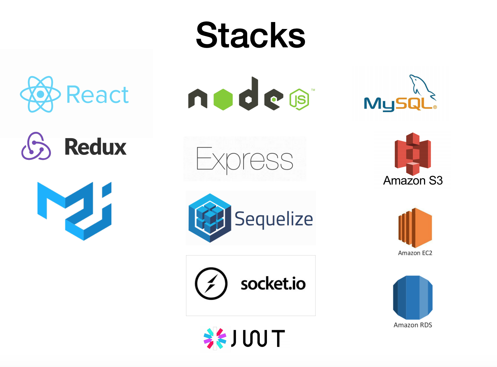
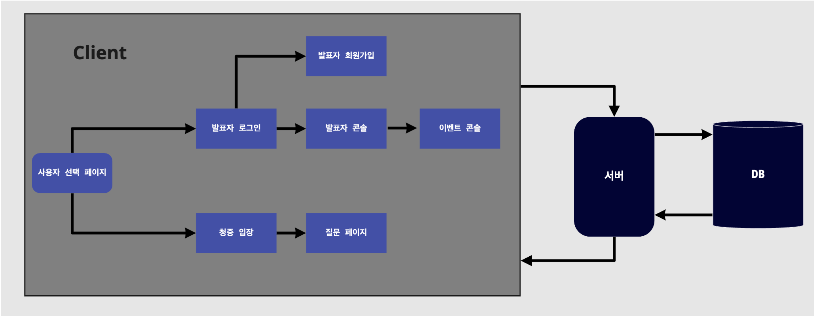
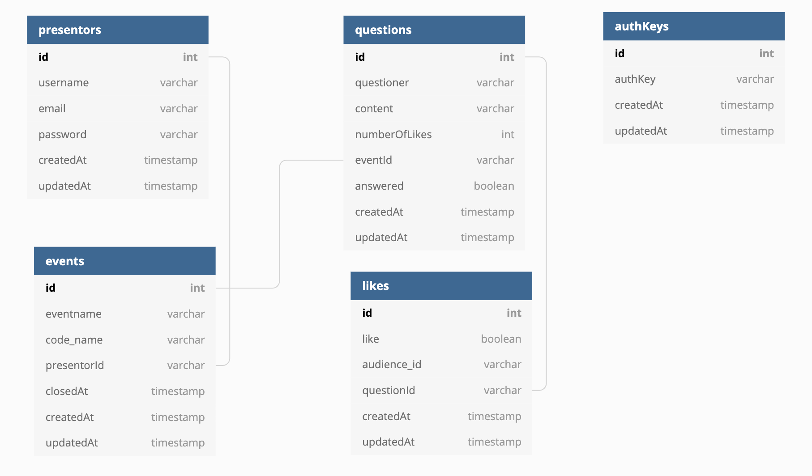
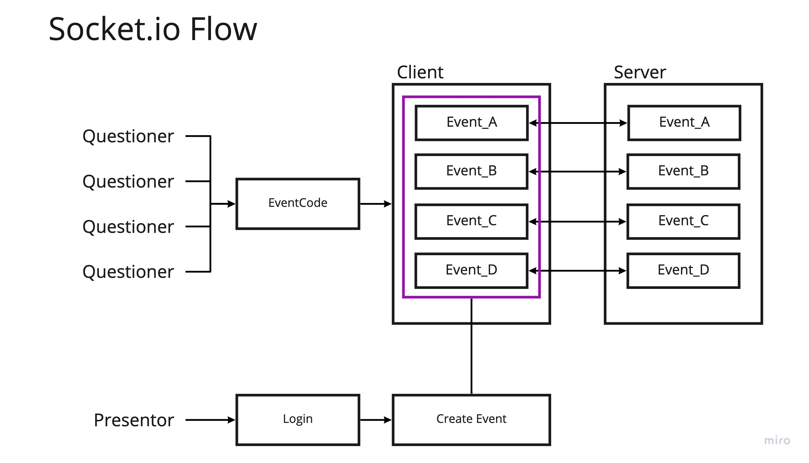
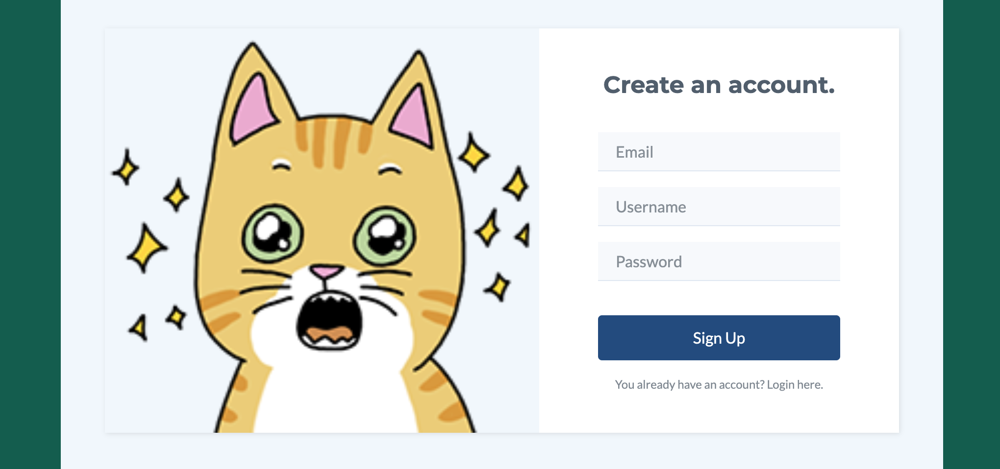
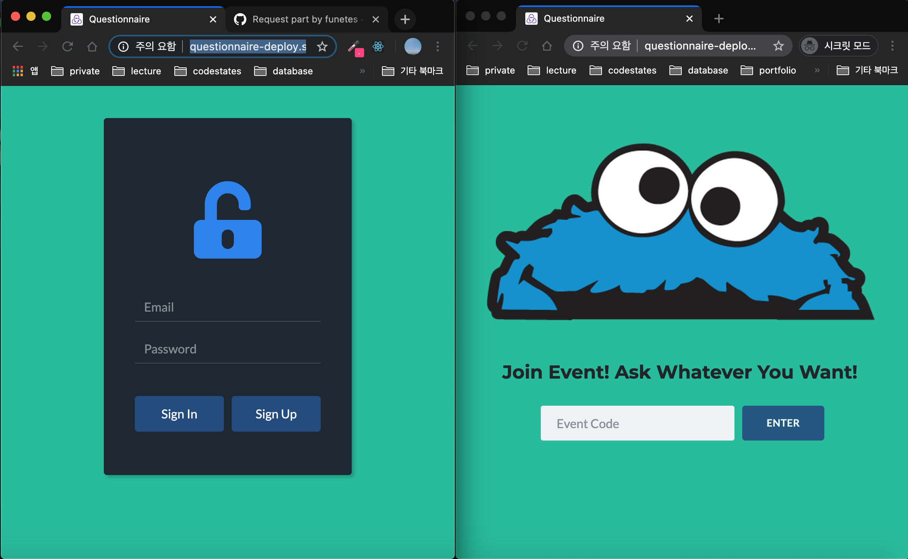
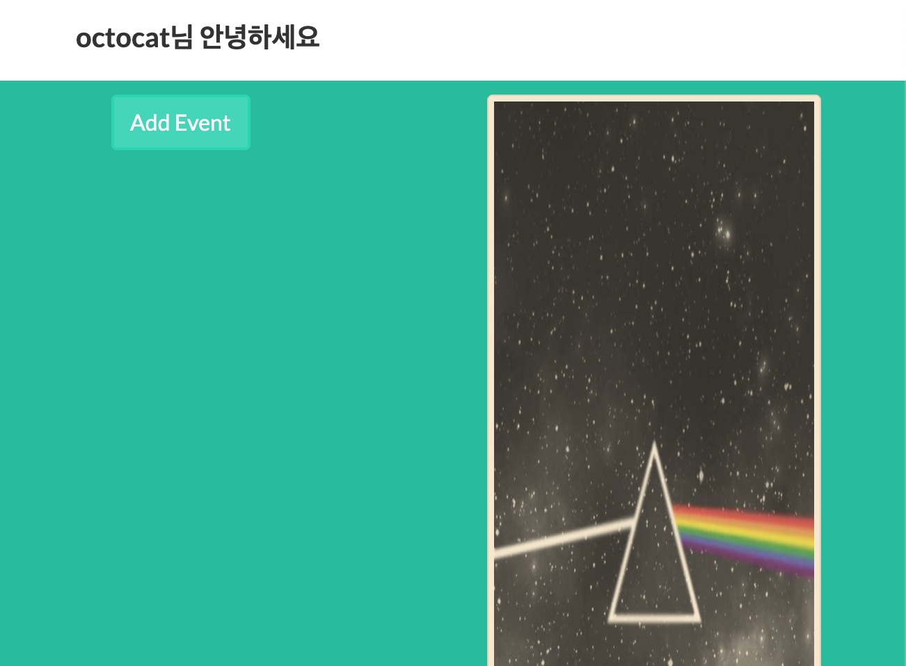

# Questionnaire

#### 수업, 발표, 컨퍼런스, 데모데이에 발표자에게 청자(익명)들이 실시간으로 질문을 하고 발표자는 해당 질문을 발표자 화면에서 정렬시켜 확인 응답할 수 있게 도와주는 서비스

---

### Project Stack

### Members

- 전진철(team leader) : back-end, https://github.com/powellstreet
- 김환(team member) : back-end, https://github.com/funetes
- 이종현(team member) : front-end, https://github.com/Jumpis

### Service Flow

### Database Schema

### Socket IO Flow

### Demonstration

사용자 선택 이미지

발표자 회원가입

발표자 로그인 & 청중 입장

발표자 콘솔

이벤트별 질문방 개설가능

질문 등록 &
좋아요 버튼을 통해 질문의 선호도 확인 가능 &
익명 유저의 좋아요 toggle

발표자 질문 답변시 청중콘솔에서 해당 질문을 hide처리

